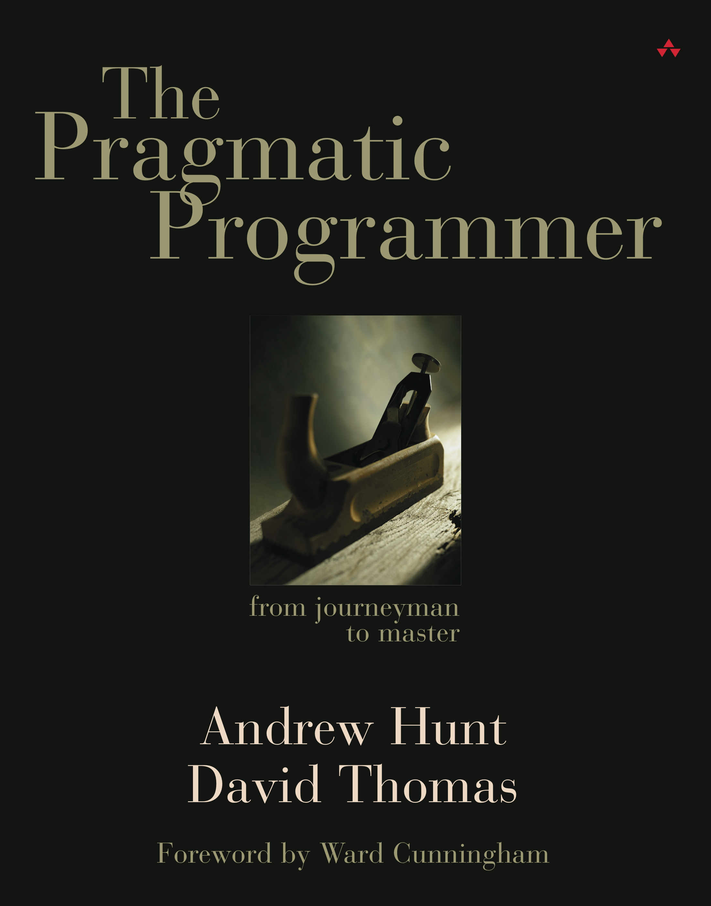

theme: Poster, 1 

## Pavel Procházka
### iOS developer at [MSD IT](https://www.msdit.cz) 👨‍⚕️
### @hello_paja 

---

## Become 10x mobile developer with HTTP proxy

---

--- 
> “Every day, work to refine the skills you have and to add new tools to your repertoire.”
-- Andrew Hunt, The Pragmatic Programmer

--- 

---

---

---

---
# HTTP proxy

---
 

---
 
# With HTTP proxy you can...

- DEBUG 🔍
- DECOUPLE FROM BACKEND 💔
- SIMULATE ERRORS 💣
- OPEN-UP SSL 🔓

---

---

# Setting it up 🚀

---
# USE-CASES

- DEBUG 🔍
- DECOUPLE FROM BACKEND 💔
- SIMULATE ERRORS 💣
- OPEN-UP SSL 🔓

---
# Debug
## 🔍

^ 
1. When you want to ensure sending and receiving proper data (headers, body, length etc.)
2. Performance measures (compression)
3. [Breakpoints](https://www.charlesproxy.com/documentation/proxying/breakpoints/) (modify requests on-fly -> change text length to test UI)

---

# Decouple from backend
## 💔

^ 
1. Map local (working offline)
2. "when BE API is not ready/deployed yet" use-case

---

# Simulate errors
## 💣

^ 
1. Rewrite - enables you to create rules that modify requests and responses as they pass through Charles. Rules such as adding or changing a header or search and replace some text in the response body

--- 

# Open-up SSL 🔓

---

^
- Easy to observe traffic ON DEVICE
- Uses ["packet tunnel"](https://developer.apple.com/documentation/networkextension/nepackettunnelprovider) [network extension](https://developer.apple.com/documentation/networkextension) to create what looks like VPN locally (VPN logo in upper-right corner), but runs all traffic through Charles locally
- CELLULAR trafic

--- 
# Alternatives

- [Wireshark](https://www.wireshark.org) (cross-platform, network _protocol analyzer_)
- [Fiddler](https://www.telerik.com/fiddler) (macOS _[beta](https://www.telerik.com/blogs/introducing-fiddler-for-os-x-beta-1)_)
- [mitmproxy](https://mitmproxy.org) (cross-platform, open sourced, _CLI_)

--- 
> “Every day, work to refine the skills you have and to add new tools to your repertoire.”
-- Andrew Hunt, The Pragmatic Programmer

--- 
# QUESTIONS?
## 💁‍♂️

--- 
# THANK YOU